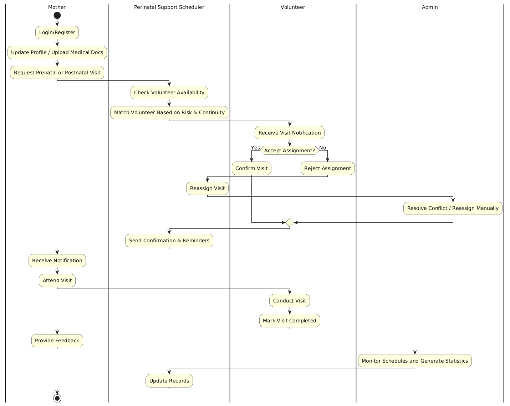
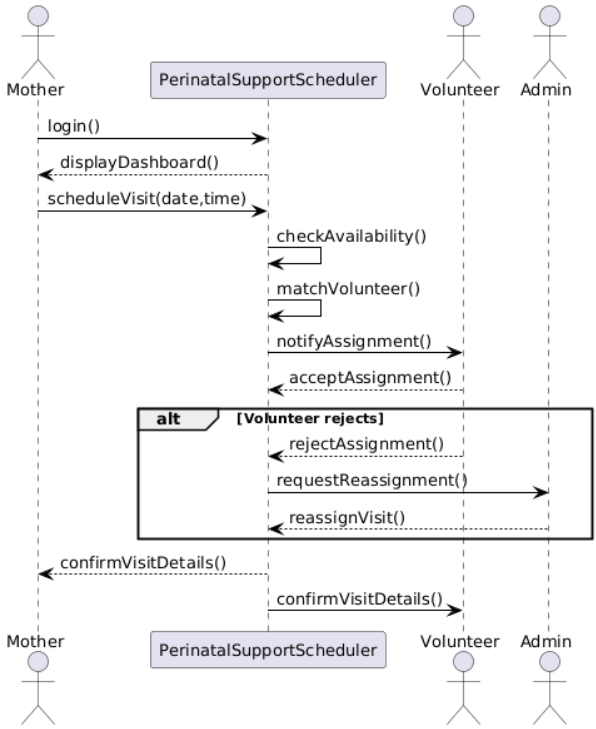
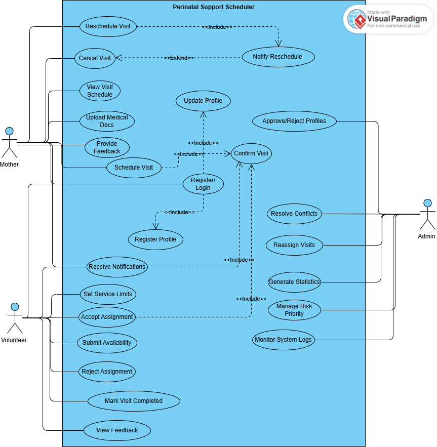
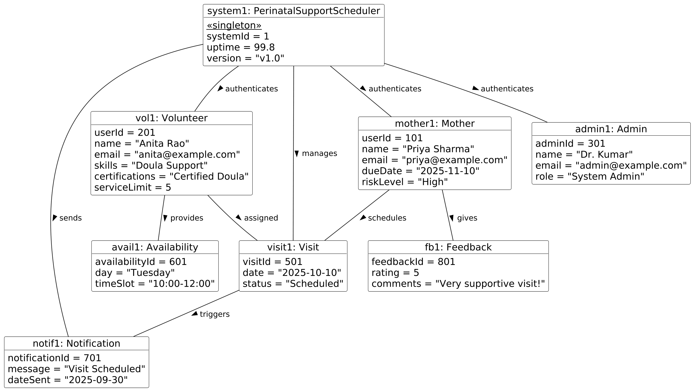
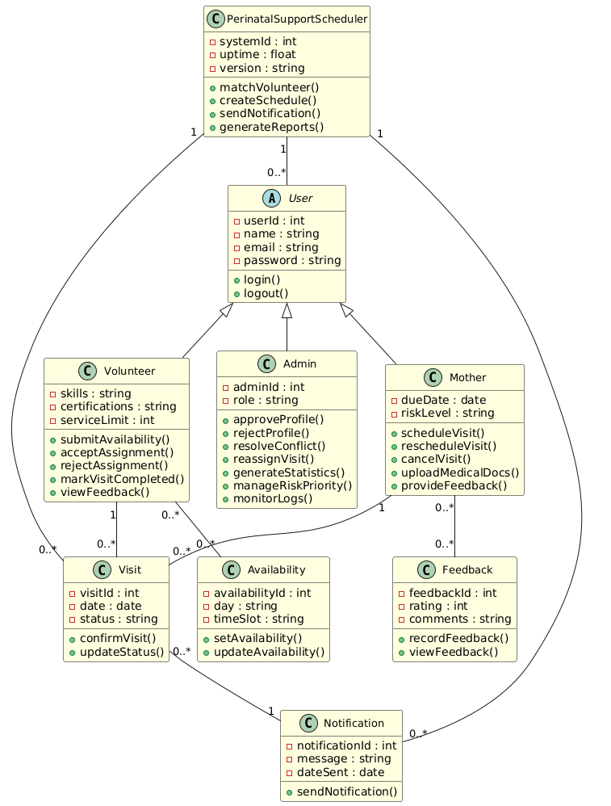
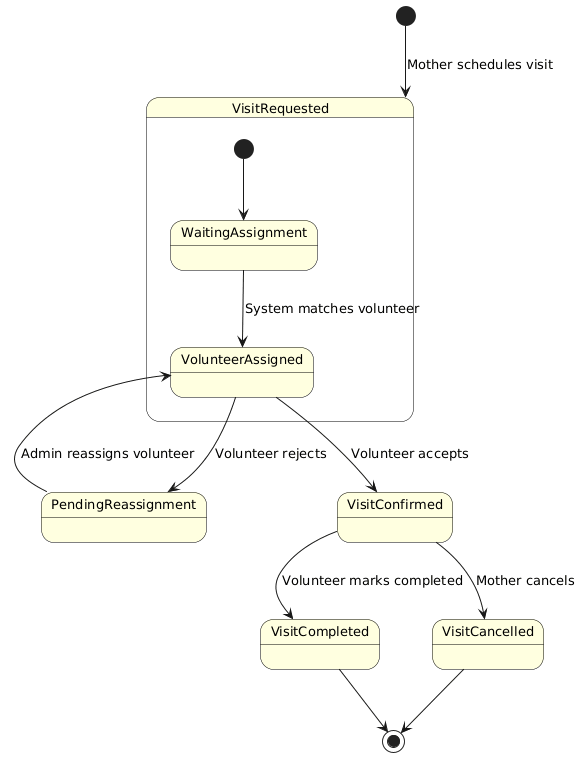

# 🤰 Perinatal Support Scheduler

---

## 📖 Project Overview
The **Perinatal Support Scheduler** is an academic project that proposes a **digital scheduling system** to support pregnant women and new mothers.  
It connects mothers with trained volunteers (doulas, nurses, helpers) and ensures **continuity of care**, **risk-based prioritization**, and **efficient scheduling**.

The system’s aim is to **reduce maternal stress and health risks by ~10%** through timely scheduling and better volunteer-mother coordination.

---

## 🎯 Key Objectives
- Provide mothers with **timely access** to prenatal and postnatal support.  
- Ensure **priority scheduling** for high-risk mothers.  
- Enable **volunteers** to set availability and service limits.  
- Allow **admins** to monitor schedules, resolve conflicts, and generate reports.  

---

## 🏗️ Core Features
### 👩 Mothers
- Register with personal details, due date, and risk level.  
- Request, reschedule, or cancel visits.  
- Upload medical documents.  
- Receive confirmations, reminders, and notifications.  
- Provide feedback after visits.  

### 👩‍⚕️ Volunteers
- Register with skills and certifications.  
- Submit weekly availability & set service limits.  
- Accept/reject visits and mark them as completed.  
- Receive notifications and view feedback.  

### 👨‍💼 Admins
- Approve/reject profiles.  
- Monitor visit schedules and resolve conflicts.  
- Reassign volunteers when needed.  
- Generate statistics and manage **risk-priority assignments**.  

---

## ⚙️ Non-Functional Requirements
- **Performance:** Respond within 3 seconds under normal load.  
- **Scalability:** Support up to 10,000 users.  
- **Availability:** 99.5% uptime.  
- **Security:** Encrypted maternal records & secure password storage.  
- **Accessibility:** Mobile-first, multilingual, WCAG 2.1 AA compliant.  

---

## 📊 System Diagrams

### Use Case Diagram (Functional Model)

### Use Case Diagram (Structural & Behavioral)

### Activity Diagram

### Class Diagram

### Object Diagram

### Sequence Diagram

### Behavioral State Machine

---

## 🗂️ Diagrams Legend
- **Use Case Diagram (Functional Model)** → Shows the interactions between Mothers, Volunteers, Admins, and the system.  
- **Use Case Diagram (Structural & Behavioral)** → Same scope but mapped to class/structural model for traceability.  
- **Activity Diagram** → Illustrates workflows like scheduling and rescheduling visits.  
- **Class Diagram** → Defines system entities such as Mother, Volunteer, Visit, Notification, and their relationships.  
- **Object Diagram** → Snapshot of objects and their state at a given moment (e.g., a scheduled visit).  
- **Sequence Diagram** → Shows message flows (e.g., scheduling request from Mother → System → Volunteer).  
- **Behavioral State Machine** → Tracks a Visit lifecycle: Requested → Assigned → Confirmed → Completed.  

---

## 📂 Repository Contents
- `System_Request/` → Business need, scope, and value  
- `Requirements_Definition/` → Functional & non-functional requirements  
- `Functional_Model/` → Use case descriptions, activity diagrams  
- `Structural_Behavioral_Model/` → Class, object, sequence, and state machine diagrams  
- `diagrams/` → Extracted PNG diagrams  
- `References/` → Research articles and academic sources  

---

## 📌 References
- Dennis, A., Wixom, B., & Tegarden, D. (2020). *Systems Analysis and Design: An Object-Oriented Approach with UML (6th ed.)*. Wiley Global Education US.  
- Richter, F. (2024, June 24). *The U.S. lags behind in fight against maternal mortality*. Statista.  

---

## 👨‍🎓 Author
**Satish Varada**  
Master’s Student, **Rivier University**  
📧 Email: svarada@rivier.edu  

---

⭐ If you found this repository useful, don’t forget to **star it**!
